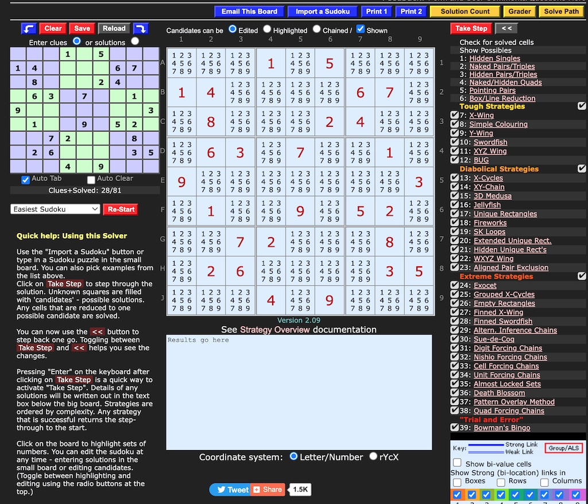
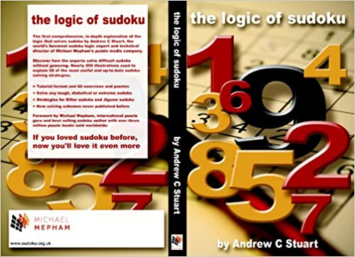
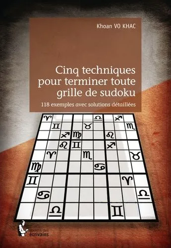
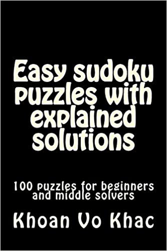
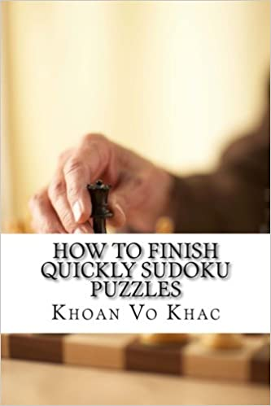

// BEGIN AsciiDoc Document Header
:sectlinks:
:sectanchors: before
:icons: font
:tip-caption: 💡Tip
:caution-caption: 🔥Caution
:important-caption: ❗️Important
:warning-caption: 🧨Warning
:note-caption: 🔖Note

link:https://www.sudokuwiki.org/sudoku.htm[Site pour jouer avec assistance automatisée en ligne
]

_Quickstart:_

. _bouton "Import a Sudoku"_ pour introduire l'énigme (_puzzle_) à résoudre;
par exemple le Sudoku du Figaro hebdo mentionné par Lê Dong
"..63....4....1..6.2..7..8...9..3....8.......5.....72..9..5...8......279..6......1"

. cliquer sur _le tableau_ pour mieux voir la situation d'ensemble d'un symbole (numéro de 1 à 9).
. vous pouvez _jouer_ à tout moment, en éditant le Sudoku sur le petit tableau à gauche, ou en commutant entre les boutons radio  "_Highlighted_" et "_Edited_" du grand tableau central.

_Besoin d'assistance ou cas de blocage ?_:

. bouton "_Take Step_" pour chaque pas vers la solution automatique.
. bouton "_<<_" pour revenir d'un pas dans la solution.
. bouton "_Solution Count_" jaune en haut à droite pour vérifier qu'il y a une solution
. bouton "_Grader_" pour vérifier la classe de la Grille (Tough, Diabolical, Extreme ...)
. bouton "_Solve Path_" pour suivre et se documenter sur les techniques conseillées.

## Cinq Techniques
Ref: <<khoan>> footnote:[C'est vrai que le formalisme à la Bourbaki rend la lecture des quelques pages théoriques difficile. Mais passée l'étape de l'assimilation du vocabulaire, les explications de Khoan dans les exemples sont géniales]

1. _Règle élémentaire (link:https://www.sudokuwiki.org/Getting_Started[Single])_ : décision (placer ou affecter un symbole) sur _une_ case
2. _Techniques pour multiplets ( link:https://www.sudokuwiki.org/Naked_Candidates#NP[Naked]/link:https://www.sudokuwiki.org/Hidden_Candidates#HP[Hidden] link:sudokuwiki[Pairs/Triples]/ link:sudokuwiki[Quads] link:https://www.sudokuwiki.org/Intersection_Removal#IR[PointingPairs] link:https://www.sudokuwiki.org/Sue_De_Coq[Sue de Coq])_ : solution tenant compte de l'identification de _multiples_ liant plusieurs cases à un ensemble donné de symboles
3. _Techniques d'attache (covering)_ : règle de _répartition quasi-idéale_ résumant l'essentiel de moultes configurations célèbres:  link:https://www.sudokuwiki.org/X_Wing_Strategy[X-wing]  , link:https://www.sudokuwiki.org/Sword_Fish_Strategy[Swordfish] , link:https://www.sudokuwiki.org/Jelly_Fish_Strategy[Jellyfish] , link:https://www.sudokuwiki.org/Finned_X_Wing[Finned X-wing], link:https://www.sudokuwiki.org/Finned_Swordfish[Finned Swordfish], https://www.sudoku9981.com/sudoku-solving/sashimi-fish.php[sashimi fish], https://sudoku.megastar.fr/2018/05/31/franken-swordfish/[frankenfish], https://www.reddit.com/r/sudoku/comments/hm5jsf/finned_mutant_whale/[ finned mutant whale], https://www.sudoku9981.com/sudoku-solving/kraken-fish.php[kraken fish] 
4. _Techniques de chaîne(chain)_ : link:http://hodoku.sourceforge.net/en/tech_chains.php[chains and loops] trois types de chaînes à _plusieurs_ symboles: CSA (Chaînes à Symboles Attachés): link:https://www.sudokuwiki.org/Digit_Forcing_Chains[Digit forcing chains], CQF (Chaînes Quasi-Figés) et CM (Chaînes Mixtes)link:https://www.sudokuwiki.org/Cell_Forcing_Chains[Cell forcing chains]; link:https://www.sudokuwiki.org/Unit_Forcing_Chains[Unit forcing chains] , link:https://www.sudokuwiki.org/Nishio_Forcing_Chains[Nishio forcing chains]
5. _Technique du dilemme (guessing)_ : choix d'une case ou d'un groupe de cases à _attacher_ ou à _interdire_ à des symboles.link:https://www.sudokuwiki.org/Bowmans_Bingo[Bowman's Bingo], https://www.sudokuoftheday.com/techniques/guesswork/[guessing]

---
Bibliography:
------------

[references]

* [[[stuart]]] Andrew C. STUART, The Logic of Sudoku - 2006 -_Reconnu même par Khoan comme le meilleur ouvrage sur la théorie des Grilles de Sudoku_  https://www.amazon.fr/Logic-Sudoku-Andrew-C-Stuart/dp/0955484103[Amazon épuisé?]

* [[[sdkwiki]]] The Daily Killer Sudoku by Andrew Stuart https://www.sudokuwiki.org[sudokuwiki.org]
* [[[str8ts]]] Daily Sudoku by Andrew Stuart https://www.amazon.fr/Logic-Sudoku-Andrew-C-Stuart/dp/0955484103[title="Andrew Stuart - The Logic of Sudoku-2006", width=80%]

* [[[khoan]]]  Khoan VO-KHAC, Cinq techniques pour terminer toute grille de sudoku - 2016, https://www.amazon.fr/techniques-terminer-toute-grille-sudoku-ebook/dp/B01EXXHWLO[site Internet 16.95€]

* [[[khoanNew]]] Khoan VO-KHAC, New Sudoku Puzzles with explained solutions - fev 2018, https://www.amazon.fr/New-Sudoku-puzzles-explained-solutions/dp/1985721945[Amazon 8.52€]

* [[[khoanEasy]]] Khoan VO-KHAC, Easy sudoku puzzles woth explained solutions -mai 2018, https://www.amazon.fr/Easy-sudoku-puzzles-explained-solutions/dp/171900532X/ref=sr_1_7?dchild=1&qid=1631178924&refinements=p_27%3AKhoan+Vo+Khac&s=books&sr=1-7[Amazon 4,22€ ]

* [[[khoan2017]]] Khoan VO-KHAC, How to finish quickly Sudoku Puzzles - 2017 :eight techniques ...https://www.amazon.fr/How-finish-quickly-Sudoku-Puzzles/dp/1545225826/ref=sr_1_8?dchild=1&qid=1631178924&refinements=p_27%3AKhoan+Vo+Khac&s=books&sr=1-8[Amazon 5,94€]

